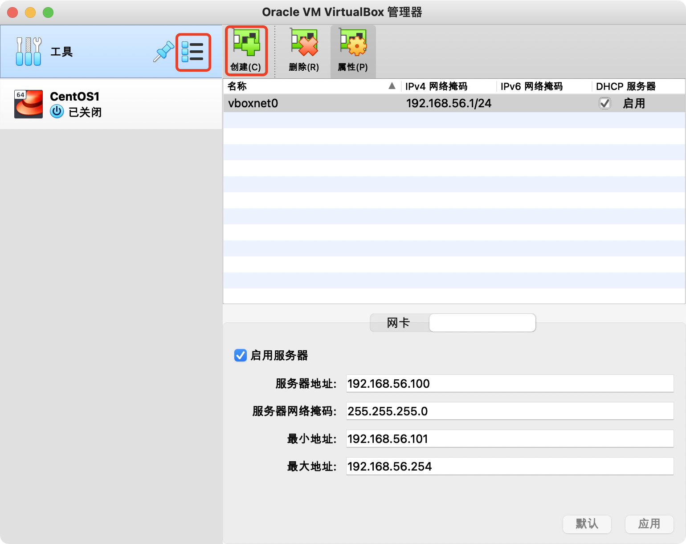
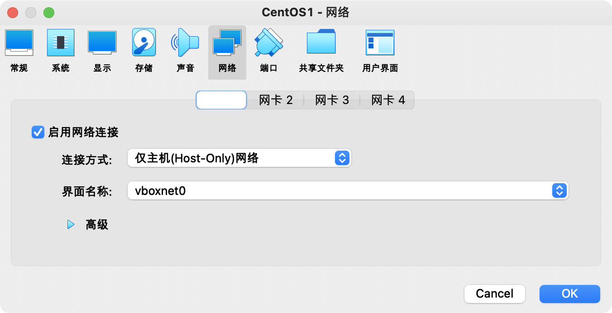
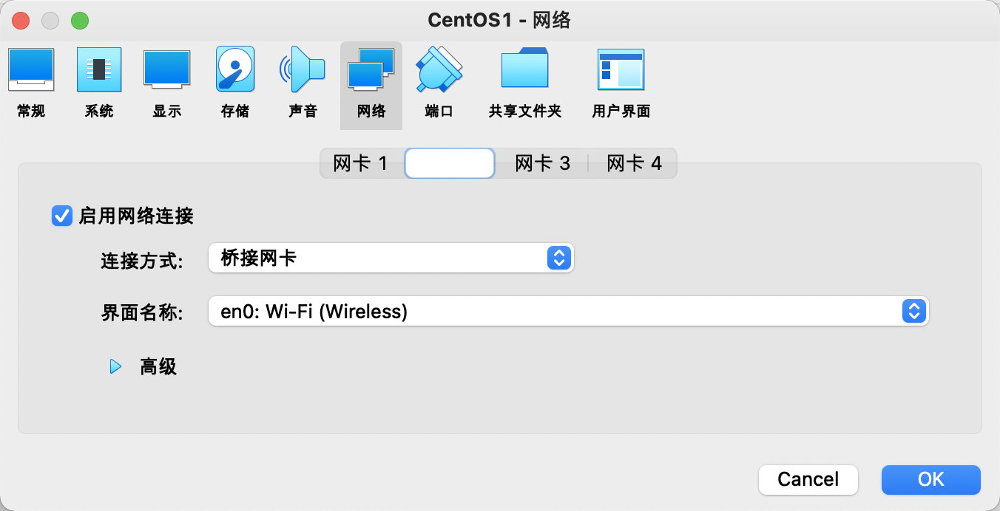

# VirtualBox安装CentOS7

## VirtualBox安装

### 下载

[VirtualBox下载地址](https://www.virtualbox.org/wiki/Downloads)

按照默认选择安装

## CentOS7下载

### 下载

[CentOS下载地址](http://isoredirect.centos.org/centos/7/isos/x86_64/CentOS-7-x86_64-Everything-1804.iso)

选择[Everything-1804.iso ](http://mirrors.tuna.tsinghua.edu.cn/centos/7/isos/x86_64/CentOS-7-x86_64-Everything-1804.iso) 64位EveryThing版本最高版本下载

## 虚拟机上安装CentOS7

### 新建

- 名称：CentOS7
- 类型：Linux
- 版本：Other Linux（64-bit）
- 下一步

### 内存

- 根据自己的电脑配置设置内存大小
- 8G内存设置2G大小，16G内存可以设置6G大小
- 同时根据自己虚拟机安装的程序多少来调大内存
- 下一步

### 硬盘

- 现在创建虚拟硬盘
- 创建
- 选择VDI（VirtualBox磁盘影像）
- 选择动态分配（可根据磁盘大小选择，磁盘空间富裕可以选择固定大小）
- 下一步

### 文件位置和大小

- 选择CentOS存放的目录
- 文件大小根据自己磁盘大小设置
- 创建

### 启动

- 点击启动按钮
- 选择下载的CentOS系统文件
- 启动
- 选择：Install CentOS 7
- 选择：中文-简体中文(中国)
- 继续
- 点击：安装位置（已选择自动分区）
- 选择自动配置分区（默认自动配置分区）
- 点击：完成
- 点击：网络和主机名
- 点击：打开
- 点击：完成
- 点击：软件选择（根据需要选择，本人选择最小安装，也可以选择GNOME桌面），选择完成后选择完成
- 点击：开始安装
- 选择：ROOT密码
- 输入：密码：root
- 两次点击完成（短密码不符合要求会提示）
- 安装完成点击：重启
- 重启后选择第一个回车（第二个选项我们不经常用，因为它是急救模式启动的选项 ，系统出现问题不能正常启动时使用并修复系统 ）
- 输入用户：root
- 输入密码：root
- 进入系统

### 配置网络

#### 四种网络连接方式

桥接模式最佳选项

|                  | NAT  | Bridged Adapter | Internal       | Host-only Adapter |
| ---------------- | ---- | --------------- | -------------- | ----------------- |
| 虚拟机->主机     | 是   | 是              | 否             | 默认不能需要设置  |
| 主机->虚拟机     | 否   | 是              | 否             | 默认不能需要设置  |
| 虚拟机->其他主机 | 是   | 是              | 否             | 默认不能需要设置  |
| 其他主机->虚拟机 | 否   | 是              | 否             | 默认不能需要设置  |
| 虚拟机之间       | 否   | 是              | 同网络名下可以 | 是                |

#### 配置桥接网络

- 打开Oracle VM VirtualBox管理器
- 选择安装的CentOs7右击，选择设置
- 选择：网络
- 连接方式：选择桥接网卡
- 界面名称：选择默认
- 点击：OK

#### 查看主机网络信息

- 启动虚拟机，并登陆
- 输入：ip address
- 查看ip地址，主机与虚拟机相互ping，虚拟机ping百度网址，都拼通说明配置成功

#### 无法访问外网配置方法

查看主机网络信息

| 属性           | 值            |
| -------------- | ------------- |
| IPv4 地址      | 192.168.9.102 |
| IPv4 子网掩码  | 255.255.255.0 |
| IPv4 默认网关  | 192.168.9.1   |
| IPv4 DNS服务器 | 192.168.10.1  |
|                | 192.168.9.102 |

1. 查看网络配置文件

   ```shell
   cd /etc/sysconfig/network-scripts;ls
   
   cat ifcfg-enp0s3
   ```

2. 动态地址修改网络配置文件

   ```shell
   TYPE="Ethernet"
   PROXY_METHOD="none"
   BROWSER_ONLY="no"
   # dhcp
   BOOTPROTO="dhcp"  
   DEFROUTE="yes"
   IPV4_FAILURE_FATAL="no"
   IPV6INIT="yes"
   IPV6_AUTOCONF="yes"
   IPV6_DEFROUTE="yes"
   IPV6_FAILURE_FATAL="no"
   IPV6_ADDR_GEN_MODE="stable-privacy"
   NAME="enp0s3"
   UUID="e6fe93bc-a190-491e-8d5b-da38179819de"
   DEVICE="enp0s3"
   # yes
   ONBOOT="yes"
   ```

3. 修改如下(上面是原文件，下面是修改的)

   ```shell
   TYPE="Ethernet"
   PROXY_METHOD="none"
   BROWSER_ONLY="no"
   #BOOTPROTO="dhcp" 注释掉
   #新增开始 虚拟机ip：192.168.9.110
   BOOTPROTO="static"
   IPADDR="192.168.9.110"
   NETMASK="255.255.255.0"
   GATEWAY="192.168.9.1"
   DNS1="192.168.10.1":
   DNS2="192.168.9.102"
   #新增完成
   DEFROUTE="yes"
   IPV4_FAILURE_FATAL="no"
   IPV6INIT="yes"
   IPV6_AUTOCONF="yes"
   IPV6_DEFROUTE="yes"
   IPV6_FAILURE_FATAL="no"
   IPV6_ADDR_GEN_MODE="stable-privacy"
   NAME="enp0s3"
   UUID="e6fe93bc-a190-491e-8d5b-da38179819de"
   DEVICE="enp0s3"
   ONBOOT="yes"
   ```

   ```
   
   vi /etc/sysconfig/network-scripts/ifcfg-enp0s3
   BOOTPROTO="static"
   IPADDR="192.168.0.121"
   NETMASK="255.255.255.0"
   GATEWAY="192.168.0.253"
   
   BOOTPROTO="static"
   IPADDR="192.168.0.122"
   NETMASK="255.255.255.0"
   GATEWAY="192.168.0.253"
   
   BOOTPROTO="static"
   IPADDR="192.168.0.123"
   NETMASK="255.255.255.0"
   GATEWAY="192.168.0.253"
   
   BOOTPROTO="static"
   IPADDR="192.168.3.23"
   NETMASK="255.255.254.0"
   GATEWAY="192.168.2.1"
   DNS1="202.106.0.20":
   DNS2="114.114.114.114"
   ```

4. 重新启动网络
```
# service network restart
```

### 常用命令安装

yum -y install vim wget cmake make unzip zip perl nodejs gcc* links* gcc-c++ build-essential zlib1g-devel libssl-devel libgdbm-devel libreadline-devel libncurses5-devel  openssh-server redis-server checkinstall lsb libxml2-devel libxslt-devel libcurl4-openssl-devel libicu-devel telnet logrotate python-docutils pkg-config autoconf libyaml-devel gdbm-devel ncurses-devel openssl* openssl-devel zlib* zlib-devel net-tools readline-devel curl curl-devel expat-devel gettext-devel  tk-devel libffi-devel sendmail patch libyaml* pcre* pcre-devel policycoreutils openssh-clients postfix policycoreutils-python lrzsz cpio perl-ExtUtils-CBuilder perl-ExtUtils-MakeMaker 

### 脚本启动虚拟机

- VirtualBox安装路径：C:/Program Files/Oracle/VirtualBox
- 虚拟机名称：CentOS7
- 创建bat文件（windows系统），将如下内容拷贝进去保存
- 点击启动即可启动虚拟机

```shell
@echo off
cd C:/Program Files/Oracle/VirtualBox
VBoxManage startvm CentOS7 -type headless
pause
exit

```

### 不同网络环境，固定IP设置，解决IP变动问题
#### 工具-网络-创建：默认即可

#### 设置-网络-网卡1

#### 设置-网络-网卡2

#### 固定IP设置
启动后进入
```shell
cd /etc/sysconfig/network-scripts/;ls

vi ifcfg-enp0s3
# 修改
BOOTPROTO="static"
# 增加
IPADDR="192.168.56.101"
NETMASK="255.255.255.0"
GATEWAY="192.168.56.255"
DNS1="114.114.114.114"
PREFIX="24"

```